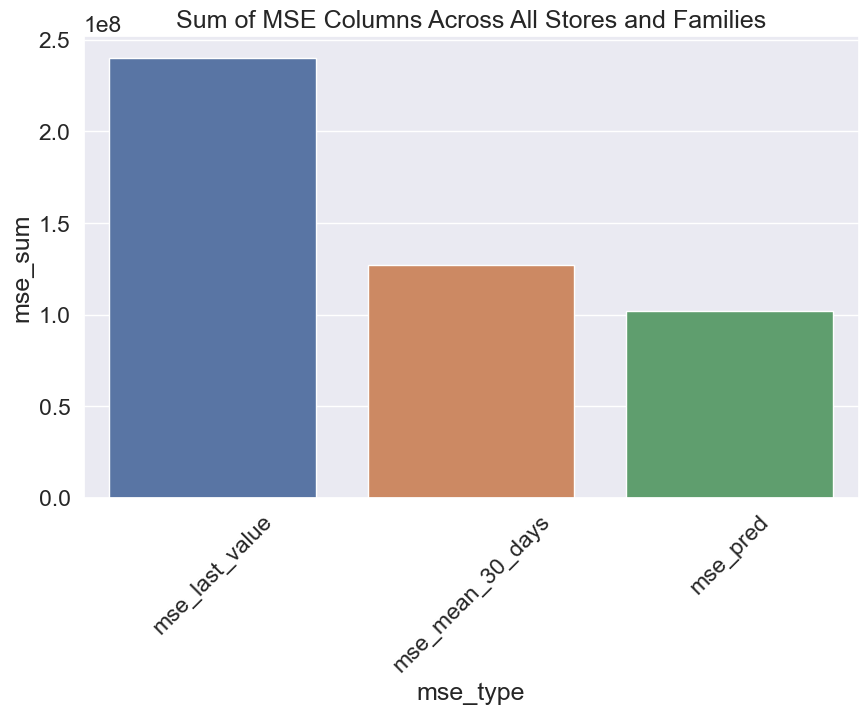
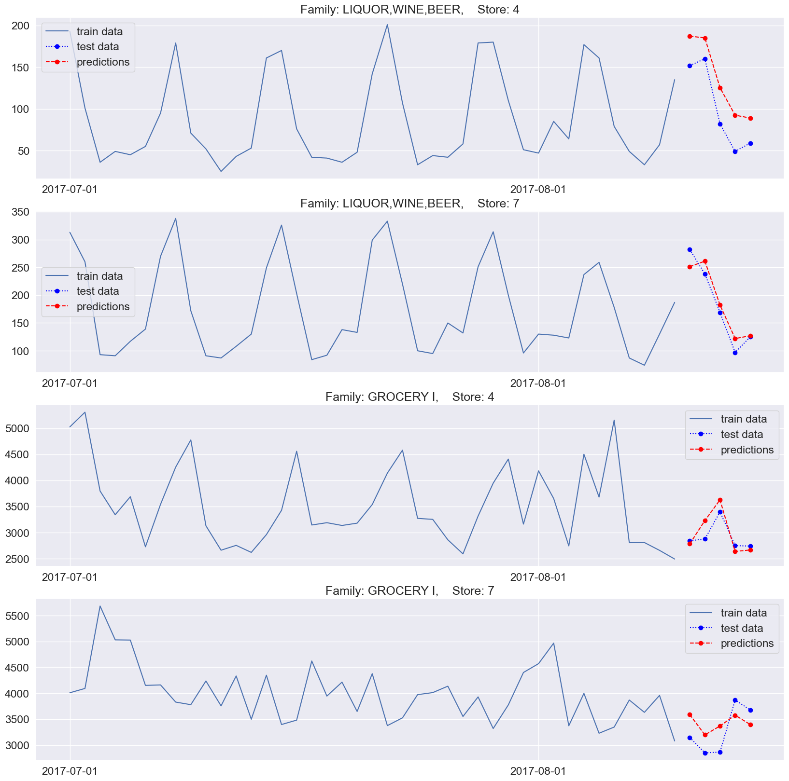

# Time-series Prediction with the Speed of ClickHouse

Time series prediction is a widespread task in data analytics and machine learning, with diverse applications in various domains and a variety of approaches to address the challenges it poses. While modern deep learning approaches such as Long Short-Term Memory (LSTM) and other state-of-the-art techniques have become popular for time series prediction due to their high accuracy, sometimes they may not be the most convenient choice. For instance, you may not want to download large datasets from a database or cloud to a data scientist's laptop or other separate environment for analysis, as the amount of data and the number of different time series can be enormous. Moreover, in certain scenarios, you may not need the most accurate prediction model but rather a fast and scalable method that still provides reasonable results. So, why consider making time series predictions directly in the database?

ClickHouse is a columnar database management system designed for high-performance data analysis. In many real-world applications, the primary concern is not the highest possible prediction accuracy but rather a solution that is fast, scalable, and capable of handling massive datasets. That's where ClickHouse comes in. By leveraging the power of ClickHouse, we can perform time series prediction directly in the database, bypassing the need for additional tools and enabling faster results with minimal overhead.

In this article, we focus on the Kaggle dataset 'Store Sales', which contains sales data for various stores and product families over time from 2013 to 2018. The dataset can be found at the following link:
https://www.kaggle.com/competitions/store-sales-time-series-forecasting/data

There are thousands of time series in this dataset, making it a great candidate for demonstrating the effectiveness of ClickHouse in handling large-scale time series data. We will implement a ARIMA like model directly in ClickHouse using the stochasticLinearRegression function. ARIMA (Autoregressive Integrated Moving Average) models are popular in time series analysis and can be effective in making predictions with relatively low computational complexity. The ARI-X model adapts the autoregressive and differencing components from the ARIMA model and incorporates additional features describing the day of the week using one-hot encoding. This results in an ARIX(7,1,0) model, defined as follows:

$$
Y_t = \phi_1 Y_{t-1} + \phi_2 Y_{t-2} + ... + \phi_7 Y_{t-7} + \theta_1W_{t1} + \theta_1W_{t2} + ... + \theta_7W_{t7} + \epsilon_t
$$

Where:
 - Y_t: The predicted value at time t.
 - Y_t-n: The value at time t-n, where n ranges from 1 to 7.
 - w_i: One-hot encoded feature representing the day of the week (i = 1 to 7, corresponding to Monday through Sunday).
 - e_t: The error term at time t.

---
### In the following sections, we will walk through the process of implementing this ARI-X model for thousand time-series in ClickHouse with a pair of querries.

Lets start by creating a view with data for each time series in array. For test data we will use 5 last days of dataset. For training data we will use all data except last 5 days. We will use this view for training and testing our model.

 

Now train our models and store then in a memory engine table.

More comments and details about the code can be found in the code https://github.com/pzlav/time-sereies-prediction-in-ClickHouse

---
### Evaluation of the model

Now that we have implemented our model in ClickHouse, it's essential to evaluate the quality of our predictions by comparing them to baseline models. To do this, we will calculate the Mean Squared Error (MSE) of our predictions and compare it with that of some simple baseline models, such as the naïve model and the moving average model.

To provide a visual representation of our predictions, let's take a pair of stores and a pair of product families as an example. Upon plotting the actual sales data and our predictions, we can observe that our model fits the data reasonably well.

However, it's important to note that this approach has several limitations and assumptions, such as:
 - The ARIMA model assumes linearity, which may not always be appropriate for real-world time series data.
 - The model parameters (7,1,0) were chosen arbitrarily and may not be optimal for all time series in the dataset.
 - The ARIMA model does not account for seasonality or other complex patterns that may be present in the data.

---
### Conclusion
In conclusion, this approach demonstrates the feasibility of performing time series predictions directly within ClickHouse using a simple ARIX model. While this approach may not be optimal for all applications, it offers a fast, scalable, and efficient alternative for handling massive datasets where high accuracy is not the primary goal. By understanding the limitations and assumptions of this method, data scientists and analysts can make informed decisions on whether this approach is suitable for their specific use cases.  